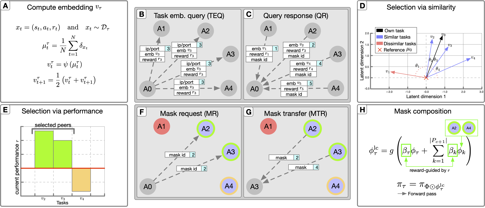

# Collaborative Learning in Agentic Systems: A Collective AI is Greater Than the Sum of Its Parts (MOSAIC)

[](https://python.org)
[](https://opensource.org/licenses/Apache-2.0)
[](https://www.arxiv.org/abs/2506.05577)



**MOSAIC (Modular Sharing and Composition in Collective Learning)** is a decentralized, agentic AI framework designed for large-scale, asynchronous reinforcement learning. In real-world settings where agents face diverse tasks, limited bandwidth, and no central controller, MOSAIC enables agents to autonomously share, select, and reuse knowledge across tasks and peers.

By combining:
- Modular policy composition via neural masks
- Selection via cosine similarity computed from Wasserstein embeddings, and performance-based criteria
- Asynchronous peer-to-peer communication

MOSAIC improves sample efficiency, enables generalization to unsolvable tasks, and facilitates the emergence of curricula through collaboration, all without coordination or centralized control.

This work is supported and inspired by the work conducted in [ShELL (Shared Experience Lifelong Learning)](https://sam.gov/opp/1afbf600f2e04b26941fad352c08d1f1/view) and [A Collective AI via Lifelong Learning and Sharing at the Edge](https://rdcu.be/dB9zt).

## Overview
The MOSAIC repository is structured as:
```
MOSAIC/
├── CurriculumMinigrid/
│   ├── curriculumMultiRoomEnv.py  # Custom MiniGrid environments
│   └── curriculumMultiRoomMh.py   # Custom MiniHack environments
├── deep_rl/
│   ├── agents/                    # Agent architectures (PPO)
│   ├── component/                 # Core components
│   ├── network/                   # Networks and ActorCritic architectures
│   ├── shell_modules/             # MOSAIC modules (comm, detect, ssmask_utils)
│   └── utils/                     # Utilities and core training loop
├── env_configs/                   # Environment details
├── RAWDATA/                       # Raw performance data for the paper
├── shell_configs/                 # Curriculum configuration
├── ymls/                          # Environment setup YAMLs
├── launcher.py                    # Orchestrates multi-agent runs
├── reference.csv                  # (IP, Port) entry points for agents
├── run_mctgraph.py                # Entry point for single agent on CT-graph
├── run_minigrid.py                # Entry point for single agent on MiniGrid
└── run_minihack.py                # Entry point for single agent on MiniHack
```

## Agent Architecture

Each agent in MOSAIC:
- Utilizes [PPO (Proximal Policy Optimization)](https://arxiv.org/abs/1707.06347) for reinforcement learning.
- Extends [Modulating Masks](https://arxiv.org/abs/2212.11110) to represent and isolate task-specific knowledge.
- Extends [Wasserstein Task Embeddings](https://arxiv.org/abs/2208.11726) to compute online task embeeddings in RL.
- Dynamically selects and blends external knowledge from peer agents via a two-phase heuristic protocol (similarity + performance).

Baseline agents are PPO-only and prone to catastrophic forgetting.

## Supported Environments

- [MiniGrid](https://github.com/Farama-Foundation/gym-minigrid)
- [CT-graph](https://github.com/soltoggio/CT-graph)
- [MiniHack](https://github.com/facebookresearch/minihack)

## Requirements

- Requirements from [DeepRL](https://github.com/ShangtongZhang/DeepRL)
- Additional:
  - `gym-minigrid`
  - `ctgraph`
  - `minihack`
- Environment setup YAMLs are located in `./ymls/`

## Usage
MOSAIC is designed to run a single agent per execution. The launcher.py file enables quick and easy concurrent execution of many agents. We recommend the use of a single device per agent, or a GPU server machine. If Multi Instance GPU is available, it is strongly recommend enabling. MIGs were used on NVIDIA A100 GPUs for the experiments in this study. 

### Run a Single Agent
All seeds used in the paper can be found in `README_seeds.md`

To run a single MOSAIC agent on Minigrid.

```
python run_minigrid.py <curriculum index> <port> -p <experiment name>
```
- The curriculum index tells the agent which curriculum of tasks to select for learning in the experiment.
- The listening port defines which port the server will listen on for incoming communication.
- The -p argument is optional and will default to the environment name.


CT-graph and MiniHack experiments can be run using run_mctgraph.py and run_minihack.py

### Run a distributed experiment
To run a multi-agent experiment with multiple agents, each with their own environment.
```
python launcher.py --env minigrid --exp <experiment folder name>
```
- The --env argument defines which setup to use. Each experiment has its own setup.
- The --exp argument defines the name of the folder in which the experiment data will be contained.
- The launcher.py file is setup to use CUDA_VISIBLE_DEVICES to define the GPU used by the agent. Our experiments have been run on Nvidia A100s using MiG configurations.

### Setting up communication
Ensure that the references.csv file contains the IPs and ports for your agents. 
```
<ip>, <port>
```

By default reference.csv file contains:

```
127.0.0.1, 29500
127.0.0.1, 29501
127.0.0.1, 29502
127.0.0.1, 29503
127.0.0.1, 29504
127.0.0.1, 29505
```

### Running on multiple devices
To run multiple agents on seperate devices, please update the addresses.csv file. This can contain one or more ip ports of other agents. For example:
```
xxx.xxx.x.x, 29500
xxx.xxx.x.x, 29501
```
To then run two agents on two different devices simply run the following commands:
```
Device 1:
python run_minigrid.py 0 29500

Device 2:
python run_minigrid.py 1 29501
```

### Configuring environments/curriculum
Curriculums and environments can be modified from the shell.json files in shell_configs/. This file contains the curriculum for each agent. Per-environment specifications can be found in env_configs/.

## Maintainers
The repository is currently developed and maintained by researchers from Loughborough University, Vanderbilt University, UC Riverside, and UT Dallas

## Bug Reporting
If you encounter any bugs using the code or have any questions, please raise an issue in the repository on GitHub.

## BibTex
To cite this work, please use the information below.
```
@misc{nath2025collaborativelearningagenticsystems,
      title={Collaborative Learning in Agentic Systems: A Collective AI is Greater Than the Sum of Its Parts}, 
      author={Saptarshi Nath and Christos Peridis and Eseoghene Benjamin and Xinran Liu and Soheil Kolouri and Peter Kinnell and Zexin Li and Cong Liu and Shirin Dora and Andrea Soltoggio},
      year={2025},
      eprint={2506.05577},
      archivePrefix={arXiv},
      primaryClass={cs.LG},
      url={https://arxiv.org/abs/2506.05577}, 
}
```

## Acknowledgements
This material is based upon work supported by the Defense Advanced Research Projects Agency (DARPA) under contract No. HR001121901 (Shared Experience Lifelong Learning) and the Industrial Robots-as-a-Service (IRaaS) project funded by the EPSRC (EP/V050966/1).

Any opinions, findings and conclusions or recommendations expressed in this material are those of the author(s) and do not necessarily reflect the views of the Defense Advanced Research Projects Agency (DARPA).
